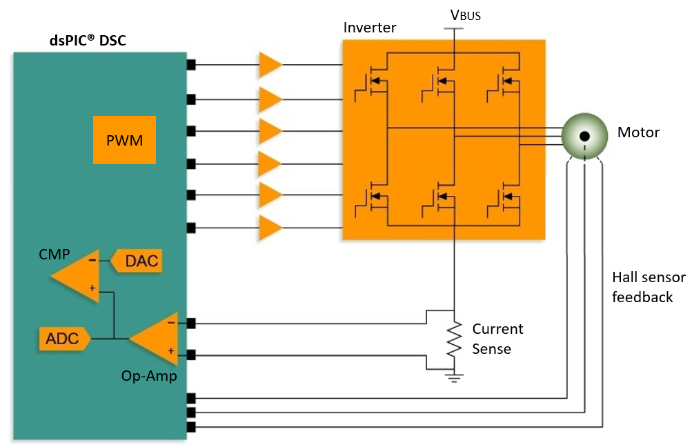
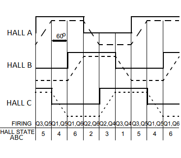

 

## AN957 Sensored BLDC Motor Control

## INTRODUCTION
Brushless DC motor (BLDC) is a type of a Permanent Magnet Synchronous Motor (PMSM). It is named ‘Brushless DC’ as there are no brushes involved in commutation and instead it is commutated electronically. To rotate the BLDC motor, the stator windings should be energized in a sequence. It is important to know the rotor position to energize the winding in the correct sequence to rotate the motor.

In this application, Hall effect sensor feedback from the motor is used to determine the rotor position. Whenever the rotor magnetic poles pass near the Hall sensors, they give a high or low signal, indicating the N or S pole of the rotor. Based on the combination of these three Hall sensor signals, rotor is commutated according to the six-step commutation scheme.

The following figures show the simplified block diagram and an example of Hall sensor signals with respect to back EMF.

The various dsPIC™ DSC families can be used to demonstrate AN957 application firmware using one of the Microchip Motor Control Development Boards. The following table summarizes Devices, Development Boards, and the source codes.

| Device |Development Board|Source Code |
| :----------:| :-------:|:----:|
| dsPIC33CK256MP508 ([DS70005349](https://ww1.microchip.com/downloads/en/DeviceDoc/dsPIC33CK256MP508-Family-Data-Sheet-DS70005349H.pdf))|dsPIC33CK Motor Control Starter Kit (MCSK) ([EV62P66A](https://www.microchip.com/en-us/development-tool/EV12F76A))| [mcsk-an957-dspic33ck256mp508](https://mplab-discover.microchip.com/v2/item/com.microchip.code.examples/com.microchip.ide.project/com.microchip.subcategories.motor-control-and-drive.motor-types.brushless-dc-bldc/com.microchip.mplabx.project.mcsk-an957-dspic33ck256mp508/1.0.1?view=about&dsl=an957)    |
| dsPIC33CK256MP508 ([DS70005349](https://ww1.microchip.com/downloads/en/DeviceDoc/dsPIC33CK256MP508-Family-Data-Sheet-DS70005349H.pdf))| DSPIC33CK Low Voltage Motor Control (LVMC) Development Board ([DM330031](https://www.microchip.com/en-us/development-tool/dm330031)) |[lvmc-dspic33ck256mp508-an957](https://mplab-discover.microchip.com/v2/item/com.microchip.code.examples/com.microchip.ide.project/com.microchip.subcategories.modules-and-peripherals.analog.adc-modules.adc/com.microchip.mplabx.project.lvmc-dspic33ck256mp508-an957/1.0.0?view=about&dsl=an957t)|
| dsPIC33CK256MP508 ([DS70005349](https://ww1.microchip.com/downloads/en/DeviceDoc/dsPIC33CK256MP508-Family-Data-Sheet-DS70005349H.pdf))|MCS MCLV-48V-300W Development Board([EV18H47A](https://www.microchip.com/en-us/development-tool/ev18h47a)) + dsPIC33CK256MP508 Motor Control DIM ([EV62P66A](https://www.microchip.com/en-us/development-tool/ev62p66a))| [mclv-48v-300w-an957-dspic33ck256mp508](https://mplab-discover.microchip.com/v2/item/com.microchip.code.examples/com.microchip.ide.project/com.microchip.subcategories.modules-and-peripherals.analog.adc-modules.adc/com.microchip.mplabx.project.mclv-48v-300w-an957-dspic33ck256mp508/1.0.0?view=about&dsl=an957)|

 ## REFERENCES:

For additional information, refer following documents or links.

1. AN957 Application Note “[Sensored BLDC Motor Control](https://ww1.microchip.com/downloads/aemDocuments/documents/OTH/ApplicationNotes/ApplicationNotes/BLDCMC00957a.pdf)”

2. [Six-Step Commutation PWM Switching Schemes for dsPIC Digital Signal Controllers](https://mplab-discover.microchip.com/v2/item/com.microchip.code.examples/com.microchip.matlab.project/com.microchip.subcategories.motor-control-and-drive/com.microchip.matlab.project.matlab-dspic33ck-curiosityboard-pwmexample-sixstep-commutation/1.0.1?view=about)

